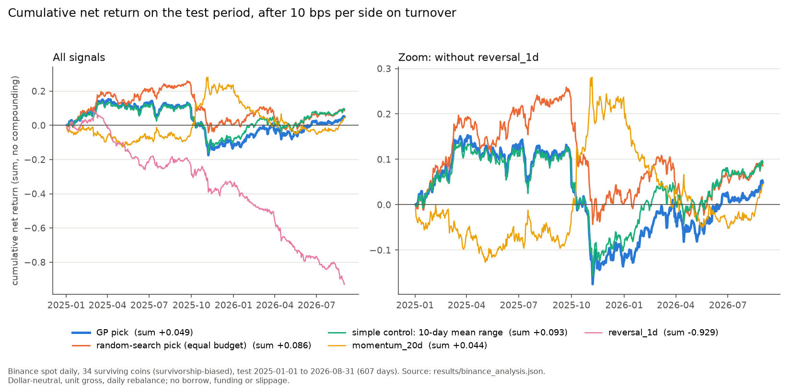
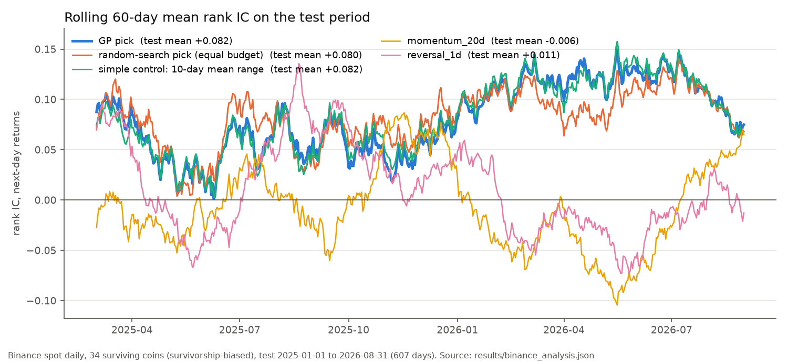

# alpha-gp-lab

*choose* on validation data and take one untouched test score, with pre-registered real-data runs
and controls. Python standard library only.

**Real-data result (Binance daily, 34 coins, test 2025-01 to 2026-08): test rank IC 0.082, net ≈ 0
after costs.** The GP's pick has test IC 0.0821 (95% block-bootstrap interval 0.06368 to 0.10035;
Bonferroni-adjusted p below 1e-9 even over all 487 expressions tried), but its net return is
8.0e-05 per day after 10 bps per side (interval −7.1e-04 to 7.7e-04, indistinguishable from zero).
The pick is a smoothed daily-range / low-volatility measure: a one-line 10-day mean range scores the
same (test IC 0.0817), and an equal-budget random search comes within noise of the GP on test IC.
Sources: `results/binance_daily_main.json`, `results/binance_analysis.json`; the universe is



```sh
export PYTHONPATH=src
python3.11 -m alpha_gp_lab demo --out runs/demo    # SYNTHETIC regime-change demo, ~10 s
bash scripts/check.sh                              # 93 tests, demo, replays; real-data steps if data/ exists
```

## The problem

factors (`rank(-ts_delta(close, 5))` and the like) for ones that predict next-period
cross-sectional returns. Search is cheap; honest evaluation is not. A search that is allowed
to look at the data it is judged on will always find something, and an LLM asked for
"good alphas" adds a second, unaudited source of ideas.

This lab asks a narrow question: if a search may only *breed* on train data, may only
*choose* on validation data, and must accept a single untouched test score, what does it
actually find, and does that survive a regime change?

## Approach (methods and algorithms)

**Grammar.** Expressions are parsed with Python's `ast` into frozen trees and never passed
to `eval`. Fields: `open, high, low, close, volume, returns`. Operators: `rank, zscore, abs,
sign, log, winsorize`, three industry-relative operators (`group_rank / group_zscore /
group_neutralize(x, industry)`), ten time-series operators (`ts_delta, ts_delay, ts_mean,
ts_sum, ts_std, ts_rank, ts_min, ts_max, ts_decay_linear, ts_corr`) and `+ - * /` (protected
division). Unknown fields, operators, windows or syntax are refused with a reason. The
semantics are local definitions written down in `src/alpha_gp_lab/evaluate.py`; they do not

**Timing and metrics.** The interval at date t opens at `close[t]` and closes at
`close[t+1]`; its signal is the expression's row at `t - delay` (delay 1 in every run here).
Each day the signal's cross-sectional ranks are centred and scaled to a dollar-neutral,
unit-gross portfolio. Per split the evaluator reports mean rank IC (Spearman, average ties),
its t-statistic, mean daily turnover (`sum |w_t - w_{t-1}|`, between 0 and 2), and mean
gross and net interval return (net = gross - `fee_bps` x turnover). A constant signal
abstains into cash.

**Genetic programming** (`src/alpha_gp_lab/gp.py`), with the budget set by config:
- generation 0: the LLM's accepted seeds, then ramped half-and-half random trees;
- tournament selection, elitism, subtree crossover, and five mutations (subtree, point,
  window, hoist, and wrapping a subtree in one of five industry-relative templates);
- depth and node-count limits; every offspring is re-parsed by the same parser as any input;
- a duplicate filter (canonical form, so `a + b` equals `b + a`) and a semantic-equivalence
  filter (a hash of the signal's ranks on every train day, so `rank(x)`, `zscore(x)` and `x`
  count as one candidate);
- fitness = mean rank IC - `turnover_penalty` x turnover - `complexity_penalty` x tree size.

**Splits.** A config gives index spans or ISO-date spans (`["2024-01-01", "2024-12-31"]`
resolves to the first and last panel dates inside it), as one fold, an explicit list of folds,
or a rolling `walk_forward` in days.

**Split roles.**
- *Train* fitness drives tournaments, elitism and the hall of fame (best train score per
  distinct signal).
- *Validation* re-scores the hall of fame, keeps candidates with IC >= `min_ic` and turnover
  <= `max_turnover`, ranks them by the same penalised fitness, and builds a shortlist with a
  correlation filter: a candidate is rejected if its mean cross-sectional signal correlation
  exceeds `max_corr` with an already-selected alpha, meaning one listed in the config's
  `existing_alphas` (alphas chosen before this run) or one already on the shortlist. The top
  of the shortlist is the final pick. The shipped configs list no existing alphas, so there
  the filter only shapes the shortlist and the pick is the best validation score; a test
  shows an existing alpha pushing the pick elsewhere.
- *Test* scores only that final pick, once.

Each evaluator is built on the panel truncated at its split's last label, so later bars do not
exist inside it.

**Walk-forward.** A list of folds, or `walk_forward` in the config, rolls train / validation / test
windows forward and reruns the whole search per fold, with no shared state; the report gives
each fold's test IC.

**Baselines.** A config may name fixed control expressions (`"baselines"`). Each fold scores
them on train, validation and test with the same evaluators, timing and costs as the GP's pick.
They never enter the GP, the hall of fame or the selection. The printed summary also counts
`validation_candidates`, every candidate the pick was chosen from on validation.

**Controls and inference** (`gp.random_search`, `src/alpha_gp_lab/stats.py`). Random search draws
the GP's budget of random expressions from its own generator and filter, with no breeding, and
goes through the same validation rule and single test score. For the real-data pick, Newey-West
t-statistics, a circular block bootstrap over days and Bonferroni bounds sit beside the i.i.d.
t-statistic the evaluator prints.

**LLM seed proposer** (`src/alpha_gp_lab/llm_seed.py`). A prompt containing a short research
brief and the grammar (never data) asks for N expressions. Responses are cached in a JSON
replay file keyed by the SHA-256 of the exact prompt. Every proposed line is parsed; invalid
lines are logged, rejected and counted (a line starting `- ` is rejected too, because a list
bullet and a minus sign cannot be told apart). The demo and the tests read only the replay file.
`seeds --live` calls the local `claude -p` CLI with the prompt on stdin, every tool disabled and
an empty working directory, and saves the answer labelled **REAL LLM OUTPUT** with the CLI
version, model and date. A run with `use_seeds: false` reads no LLM output at all. The one live
attempt so far failed before reaching a model (see Results). The only shipped replay entry is
labelled **HAND-WRITTEN FIXTURE (not real LLM output)**. It was written while building this repo,
by someone who knew how the synthetic data is generated, and it deliberately contains one
duplicate and three invalid lines. It is used by the SYNTHETIC demo only.

**Data adapters** (`src/alpha_gp_lab/data.py`):
- a SYNTHETIC generator whose next-day returns load on lagged reversal and momentum
  features according to a regime per segment: `reversal`, `momentum`, `noise`, and `adverse`
  (reversal with its sign flipped);
- a loader for a directory of daily OHLCV CSVs (one per symbol, optional `groups.csv`);
- `scripts/fetch_binance_daily.py`, which downloads Binance public spot daily klines from
  data.binance.vision and verifies each archive's SHA-256 against its `.CHECKSUM` file. It was
  run once, with permission, for the universe pinned in `fixtures/binance_universe.json`
  (symbols, date range and each CSV's SHA-256). `verify-data` checks a local directory against
  that file. The CSVs are not committed. The fetcher's URL building, checksum logic and kline
  conversion are unit-tested offline.

in-memory fake transport that returns fixture responses, and a submit / poll / fetch client
that parses the expression locally before anything reaches the transport. There is no
endpoint URL anywhere in the package.

**Persistence and replay** (`src/alpha_gp_lab/store.py`). Each run writes a fresh directory:
exact config bytes, the panel, the LLM seed record, the code hashes, an append-only SQLite
lineage (nodes, parent edges, per-split results, selections, LLM verdicts; triggers abort any
UPDATE, DELETE or key-colliding INSERT, so `INSERT OR REPLACE` cannot rewrite a row either),
the report, and last a hash manifest. `verify` checks the hashes, the code and platform
identity, the inputs (a synthetic panel must be exactly what its config generates), compares
the stored schema and trigger SQL with the expected DDL, recomputes the entire experiment and
compares it byte for byte, then reads every SQLite row back. A directory without the manifest (an interrupted run) is kept
but refused for reuse.

### Design decisions and trade-offs

- **Parse, never `eval`.** LLM text and offspring go through the same `ast`-based parser, so a
  hostile line cannot run. The cost is a hand-maintained grammar: anything outside it is
  refused, not guessed.
- **Standard library only.** It runs on a bare Python 3.11 with nothing to install. The cost is
  speed: one real-data run takes about 90 s in pure Python, and nothing is vectorised.
- **Split roles enforced by construction.** Each evaluator only holds the panel up to its own
  split's end, so test bars cannot reach the search. The protection is against leakage, not
  against a regime that starts after validation (the synthetic demo shows that).
- **Pre-registered real-data configs.** The configs were committed before any real-data run, so
  thresholds could not be tuned on the results. The cost: guesses such as min IC 0.01 stay
  fixed even where they turn out weak (walk-forward fold 1).
- **Rank IC as fitness and selection score.** It is robust to fat-tailed returns and needs no
  position sizing. The cost: it ignores costs and dollar P&L, and on the real data it picked a
  signal whose validation net was negative.
- **Random search shares the GP's filter and validation rule.** The control differs from the GP
  only in having no breeding, so a difference between them is the GP's contribution. The cost:
  it inherits the GP's generator, so it says nothing about a smarter non-evolutionary search.
- **Delay 1, close-to-close.** A signal never sees the bar it trades on. The cost: a day is
  skipped, which handicaps short-horizon reversal.
- **Append-only lineage and full recomputation in `verify`.** Every candidate and score can be
  replayed exactly. The costs: each run computes twice, and a bundle only verifies on the
  platform that wrote it.
- **Real data pinned by hash, never committed.** The repository stays small and redistributes no
  exchange data, while `verify-data` proves which files were used. The cost: readers download
  the data themselves.

## Results (real numbers with their source; synthetic clearly labelled)

Values are copied from the JSON each command prints (full precision). "net" is the mean
hypothetical return per daily interval of a unit-gross, dollar-neutral portfolio after the fee
on turnover; "sum" adds the daily values without compounding.

### Real data (Binance daily, 34 coins, 2020–2026)

**Survivorship bias: these 34 coins are USDT pairs still trading in 2026, chosen in 2026.
Every number in this subsection is biased toward coins that survived.** KNCUSDT failed to
download and is excluded. One venue, daily bars, no borrow or funding costs (see Limits).

*Data.* Binance spot 1d klines from data.binance.vision, 2,435 days per coin, 2020-01-01 to
2026-08-31, pinned in `fixtures/binance_universe.json` (symbol list, date range, SHA-256 of
each CSV). `PYTHONPATH=src python3.11 -m alpha_gp_lab verify-data` prints `"ok": true` and exits
0 on the local copy. The CSVs are not in the repository.

*Pre-registered setup.* `fixtures/binance_daily_config.json` and
`fixtures/binance_walkforward_config.json` were committed in `3efa07d`, before any GP or
baseline was run on the real data, and were not changed afterwards:
- train 2020-01-01 to 2023-12-31, validation 2024-01-01 to 2024-12-31, test 2025-01-01 to
  2026-08-31 (607 daily intervals);
- delay 1 (signal from data through day t-1, held from the close of t to the close of t+1);
- costs 10 bps per side, i.e. 10 bps on every unit of notional traded;
- one group: crypto has no industries, so the industry operators act on the whole cross-section;
- GP seed 20261003 (the only seed tried), the synthetic demo's budget (population 64,
  10 generations, hall of fame 16), fitness penalties 0.02 x turnover and 0.001 x size;
- selection: validation IC >= 0.01, turnover <= 1.0, correlation <= 0.7;
- baselines in the same run: `momentum_20d` = `close / ts_delay(close, 20)` (the 20-day return)
  and `reversal_1d` = `-returns`, on the same splits, timing and costs.

**Main run** (no LLM seeds). Command:
`PYTHONPATH=src python3.11 -m alpha_gp_lab run --config fixtures/binance_daily_config.json --out runs/binance-main`.
Output: `results/binance_daily_main.json`.

| Signal | Validation IC | Test IC (t-stat) | Test turnover | Test gross / day | Test net / day (t-stat) | Test net, sum over 607 days |
|---|---:|---:|---:|---:|---:|---:|
| GP pick `abs(ts_decay_linear((low / close), 10))` | 0.07148111461736868 | 0.08208763518369619 (7.106267209479283) | 0.27298586844370465 | 0.0003534791635240535 | 8.049329508034882e-05 (0.2184396051637011) | 0.04885943011377173 |
| momentum_20d `(close / ts_delay(close, 20))` | -0.017496146192444408 | -0.006158512090458223 (-0.5588498549217263) | 0.3045894780045946 | 0.0003768912600628651 | 7.23017820582705e-05 (0.1835034941876255) | 0.04388718170937019 |
| reversal_1d `-returns` | 0.012864710545246051 | 0.011485586060223782 (1.1150804633424585) | 1.3103524132462043 | -0.0002194546543761369 | -0.0015298070676223413 (-4.090451699976516) | -0.9285928900467612 |
| *random search, equal budget* `ts_decay_linear(-ts_std(returns, 5), 20)` | 0.04790283617149554 | 0.08001626010548919 (6.7788549855658005) | 0.11008818683981006 | 0.0002515778361908061 | 0.00014148964935099608 (0.37756295049535377) | 0.08588421715605463 |
| *simple control* range_10d `-ts_mean(((close - low) / close), 10)` | 0.0675223594147245 | 0.08168754151237534 (7.120987588283992) | 0.23781374164163194 | 0.00039088590783317885 | 0.0001530721661915469 (0.42775063095956656) | 0.09291480487826898 |

The first three rows are the pre-registered main run. The two rows in italics come from the
pre-registered follow-up analysis below (`results/binance_analysis.json`, `table`): they were not part
of the main run and did not influence its pick.

- The pick was made by crossover in generation 6. Its validation net was
  -0.00041132983838806654 per day (t-stat -0.6699945071164971): the selection rule ranks by
  IC-based fitness and does not look at net returns.
- **Against the controls:** the pick beats both baselines on test IC. On test net it is above
  both, but only just above `momentum_20d` (8.049329508034882e-05 vs 7.23017820582705e-05 per
  day), and its net t-stat of 0.2184396051637011 cannot be told apart from zero. Momentum earned slightly *more* gross (0.0003768912600628651
  vs 0.0003534791635240535 per day); the pick's edge in net comes from lower turnover. On this
  sample the test net is positive and above both baselines, but it is not evidence of a
  profitable strategy.
- `reversal_1d` has a positive test IC but loses after costs (turnover 1.3103524132462043,
  net t-stat -4.090451699976516); under delay 1 it also skips a day before trading.
- The 14 candidates the correlation filter rejected are all variants of the same daily-range
  ratios (`low / high`, `low / close`, `open / high`), each correlated above 0.7 with the pick
  (`correlation_rejected` in the run's `report.json` lists them with their correlations): the
  hall of fame was essentially one idea.

**Walk-forward**, four rolling yearly folds (two years train, one validation, one test), same
settings. Command:
`PYTHONPATH=src python3.11 -m alpha_gp_lab run --config fixtures/binance_walkforward_config.json --out runs/binance-wf`.
Output: `results/binance_walkforward.json`.

| Fold | Train / validation / test | GP pick (origin) | Validation IC | Test IC (t-stat) | Test net / day (t-stat) | Days with a defined IC (validation / test) | Test IC: momentum_20d / reversal_1d | Test net / day: momentum_20d / reversal_1d |
|---:|---|---|---:|---:|---:|---:|---:|---:|
| 0 | 2020–2021 / 2022 / 2023-01 to 2023-12 | `abs(ts_decay_linear(((low + low) / high), 20))` (mutation:subtree, gen 9) | 0.0972391015759644 | 0.04926120863890851 (2.991478763240003) | -0.0001906847106677105 (-0.3942232962089944) | 364 of 364 / 364 of 364 | -0.04321781216397266 / 0.028308526631794412 | -0.0002851170095445421 / -0.0005510324356024837 |
| 1 | 2021–2022 / 2023 / 2024-01 to 2024-12 | `ts_min(ts_mean(ts_corr(low, low, 3), 3), 3)` (crossover, gen 7) | 0.022632785897698147 | -0.040810366686938666 (-0.7607723819039659) | -1.587844156803073e-06 (-0.06876089594446956) | 10 of 364 / 5 of 365 | -0.017496146192444408 / 0.012864710545246051 | 0.0006836112765127413 / -0.001741581359885962 |
| 2 | 2022–2023 / 2024 / 2025-01 to 2025-12 | `ts_sum(ts_sum(ts_sum(ts_min(returns, 5), 20), 5), 20)` (crossover, gen 8) | 0.0394824080783983 | 0.06430799835763458 (3.495329956753379) | 0.0008274287240752346 (1.570693234427387) | 365 of 365 / 364 of 364 | 0.006810627137847665 / 0.03445099387783291 | 0.0006513061922729902 / -0.0009755359373508695 |
| 3 | 2023–2024 / 2025 / 2026-01 to 2026-08 | `ts_min((ts_min(low, 20) - group_neutralize(zscore(returns), industry)), 20)` (crossover, gen 8) | 0.0739947424704937 | 0.09319068722568953 (6.035930760406955) | 0.0008513965938700916 (1.620099777311947) | 364 of 364 / 242 of 242 | -0.02305913358334184 / -0.02376317181800733 | -0.0006945371542677393 / -0.0024008227684519583 |

Printed summary: 4 folds, 4 with a selection, mean test IC 0.04148738188382349, 3 folds
positive and 1 negative. The GP's test IC is above both baselines in folds 0, 2 and 3 and below
both in fold 1. Fold 1's pick, `ts_corr(low, low, 3)` underneath, is constant on almost every
day (the correlation of a series with itself), so it abstains into cash and its IC rests on
10 validation days and 5 test days: the qualification rule has no minimum-coverage check. Fold 3's
pick subtracts a z-score from `ts_min(low, 20)`, a raw price in USDT, so for most coins it ranks by
price level. Folds 2 and 3 overlap the main run's test period; they are separate searches on
different training windows, not extra evidence for the main pick.

**LLM seeds: not run. Live LLM seeds pending: CLI login expired on 2026-10-03.** The single
permitted live call,
`PYTHONPATH=src python3.11 -m alpha_gp_lab seeds --live --config fixtures/binance_daily_config.json`,
exited 1 before reaching a model: `claude auth status` reports the local CLI is not signed in,
and the CLI's JSON shows 0 input and 0 output tokens. Nothing was saved as LLM output, and no
retry was made (1 of the 3 allowed calls used). Record: `results/llm_live_attempt.json`. So the
seeded run (`fixtures/binance_daily_seeded_config.json`, pre-registered in `3efa07d`, identical
to the main config except `use_seeds`) has not been run, and there is no seeded-vs-ablation
comparison on real data. The ablation without seeds is the main run above.

**Every real-data run, and the multiple-testing count.**

| # | Command | Code | Exit | What happened |
|---:|---|---|---:|---|
| 1 | `verify-data` (several times, and inside `check.sh`) | from `3efa07d` on | 0 | 34 files match the pinned SHA-256s, rows and dates |
| 2 | `seeds --live` (main config) | `3efa07d` | 1 | CLI not signed in; no LLM output |
| 3 | `run` main config | `90337d2` | 0 | the numbers above; printed before `net_tstat` existed; output overwritten by run 4 |
| 4 | `run` main config | `2ba1d3a` | 0 | identical numbers plus `net_tstat`; overwritten by run 6 |
| 5 | `run` walk-forward config | `2ba1d3a` | 0 | identical numbers, without `mean_gross` and `valid_ic_intervals`; overwritten by run 7 |
| 6 | `run` main config | `6352651` | 0 | committed as `results/binance_daily_main.json` |
| 7 | `run` walk-forward config | `6352651` | 0 | committed as `results/binance_walkforward.json` |
| 8 | `scripts/analyze_binance.py` (follow-up plan) | `c5e212e` | 0 | committed as `results/binance_analysis.json`; 20 GP and 20 random-search seeds |

Runs 4 to 7 were repeated only to print two more statistics (`net_tstat`, then `mean_gross` and
`valid_ic_intervals`); every number that existed before was reproduced exactly, and the
selection does not read the added fields. Each `run` also replays itself once inside `verify`,
and `scripts/check.sh` re-runs the main config and compares it with the committed file. A
timing run on SYNTHETIC data shaped like the real panel (34 assets, 2,435 days) was made before
pre-registration; it used no real data.

Multiple testing: 1 main config, 1 walk-forward config and 1 GP seed were tried; no config,
seed or threshold was changed after a real-data result. In the main run the GP scored 640
candidate occurrences (487 distinct expressions) on train, 16 hall-of-fame candidates on
validation, and tested 1. The walk-forward scored 16 candidates on validation in each of its 4
folds (64 in total; 479, 471, 498 and 488 distinct expressions on train). The 2 baselines were
also scored on validation and test in every fold, as controls that cannot be selected. The printed t-statistics
do not adjust for this; the follow-up analysis below does.

#### Follow-up analyses (pre-registered)

Plan: `fixtures/binance_analysis_config.json` and `scripts/analyze_binance.py`, committed in
`c5e212e` before either was run on real data. Command (run once, exit 0, about 6 minutes on 10
processes): `PYTHONPATH=src python3.11 scripts/analyze_binance.py --config fixtures/binance_analysis_config.json --out results/binance_analysis.json`.
The script refuses to run unless its rerun of the main config's seed reproduces
`results/binance_daily_main.json`, so everything below is about the same pick. The main config and
the numbers above were not changed. Every value below is in `results/binance_analysis.json`.

**1. Equal-budget random search.** `gp.random_search` draws random expressions from the GP's own
generation-0 generator (same grammar, depths and windows), admits them through the same size,
duplicate, degenerate and equivalence filter until it holds 640, takes the 16 best on train as its
hall of fame, and then applies the GP's validation rule and one test score. That is the GP's budget
of 640 scored candidates and 16 validation candidates, without breeding. Repeats are refused across
the whole sample, so random search scores 640 distinct expressions to the GP's 487, which slightly
favours random search.

- Same seed as the main run (20261003): the random-search pick (table above) has test IC
  0.08001626010548919 against the GP's 0.08208763518369619. The mean daily difference in IC,
  GP minus random, is 0.002071375078206996 with a 95% block-bootstrap interval of
  -0.009921112586589882 to 0.01383129666553508: **on test IC, GP does not beat random search.** On
  test net the random pick earned more (0.00014148964935099608 vs 8.049329508034882e-05 per day;
  difference interval -0.00043579238701655563 to 0.00033671739522876676), also within noise.
- Over the 20 pre-registered seeds (20261003 to 20261022; every search selected a candidate):

| Search | Test IC: mean (sd) | Test IC: min / max | Test IC > 0 | Test net / day: mean (sd) | Test net > 0 |
|---|---:|---:|---:|---:|---:|
| GP | 0.07388586321664807 (0.013659820943687753) | 0.04625279433014809 / 0.09506108299321919 | 20 of 20 | 0.0002368738116273152 (0.00034361327676581024) | 16 of 20 |
| Random search | 0.06680987612562639 (0.026109551001904433) | -0.005359901932605528 / 0.0866857539846881 | 19 of 20 | -8.902775539050045e-05 (0.0003306100440178426) | 8 of 20 |
| GP minus random (Welch SE) | 0.007075987091021682 (0.006589003573130991) | | | 0.00032590156701781564 (0.00010662389159452423) | |

  By the pre-registered rule (a difference above 2 standard errors), **GP does not beat random
  search on test IC** (1.07 SE) and **does beat it on test net** (3.06 SE). Two caveats on the net
  result: all 40 searches share one test period, so seeds are not independent evidence about the
  future, and the GP's own mean net across seeds is not separately significant. A post-hoc
  description, not pre-registered: the random picks are mostly raw one-day range ratios such as
  `low / high`, with a mean test turnover of 0.373 against 0.142 for the GP picks (means of
  `per_seed[].test.mean_turnover`), so the GP's net advantage looks like smoothing (lower
  turnover), not a better signal.

**2. Multiple-testing accounting** for the pick's test IC and net.

- Trials: the GP scored 640 candidate occurrences (487 distinct expressions) on train, 16 on
  validation and 1 on test; random search 640 (640 distinct), 16 and 1 (`trials`). The follow-up
  also ran 19 more GP seeds and 20 random-search seeds; none of them can change the pick.
- Autocorrelation: the evaluator's `ic_tstat` (7.106267209479283) and `net_tstat` divide by the
  i.i.d. standard error, so **they do not account for autocorrelation.** Newey-West t-statistics
  (Bartlett kernel; 5 lags by the usual rule of thumb for 607 days, and 20 lags): test IC
  7.599252358060714 and 8.748327616754851; test net 0.20679410837004805 and 0.21428399697840456.
  The daily ICs are slightly negatively autocorrelated, so the correction raises the IC t rather
  than lowering it.
- Block bootstrap (circular, 20-day blocks, 10,000 resamples, seed 20261003; IC and net use the
  same resampled days), 95% intervals of the test mean (`inference`):

| Signal | Test IC interval | Test net / day interval | Share of resampled net means <= 0 |
|---|---:|---:|---:|
| GP pick | 0.0636799402903561 to 0.10035325365701847 | -0.0007064142854871428 to 0.0007678056491314962 | 0.3947 |
| Random-search pick | 0.0624403493898164 to 0.09741090083772667 | -0.0007400820427339123 to 0.0009270157135124233 | 0.3472 |
| Simple control (range_10d) | 0.06263203897459231 to 0.10038758633313695 | -0.0005920896054684247 to 0.0008186950594915661 | 0.3175 |
| momentum_20d | -0.02939096537080695 to 0.01695088780978325 | -0.0007482154064405774 to 0.000982818885975489 | 0.451 |
| reversal_1d | -0.013509788442234168 to 0.03743229126264225 | -0.0023693024297604644 to -0.0006975015498045824 | 1.0 |

- Bonferroni: one hypothesis was tested (the pick), so Holm's step-down gives the same number.
  Two-sided normal p-values for the pick's test IC, multiplied by the number of candidates
  (`significance`):

| t-statistic | p | x 16 validation candidates | x 487 distinct train expressions |
|---|---:|---:|---:|
| i.i.d. (7.106267209479283) | 1.1922348460025308e-12 | 1.9075757536040492e-11 | 5.806183700032325e-10 |
| Newey-West, 5 lags (7.599252358060714) | 2.978464581746037e-14 | 4.76554333079366e-13 | 1.4505122513103202e-11 |
| Newey-West, 20 lags (8.748327616754851) | 2.1653783596568337e-18 | 3.464605375450934e-17 | 1.0545392611528781e-15 |

  The test IC survives every correction. The net return was never significant, so there is nothing
  to correct there: the honest summary is a strong, robust ranking signal with no demonstrated
  profit after costs.

**3. What the pick is.** `abs(ts_decay_linear((low / close), 10))`: `low / close` lies in (0, 1]
for positive prices, so `abs` does nothing (GP seed 20261019 found the same expression without
`abs`, with identical test numbers). The signal is a linearly weighted 10-day mean of how close each
day's close sat to its low; it is high for coins with small recent `(close - low) / close`, a
downside-range measure. Long calm coins, short coins with wide recent ranges: a low-volatility /
low-range effect. On train and validation only (never test), its mean cross-sectional rank
correlation is 0.9393280472063433 / 0.9439588936446309 with the 10-day mean range and
0.686944980784657 / 0.7197994914030369 with negative 20-day realised volatility
(`interpretation`). Two of the 20 GP seeds picked negative 20-day volatility itself
(`-ts_std(returns, 20)` and its z-score), and the random-search picks are mostly range ratios.

The pre-registered control, the plain 10-day mean of `(close - low) / close` (negated), does as
well as the GP's pick: test IC 0.08168754151237534 vs 0.08208763518369619 (difference interval
-0.0044459023786067395 to 0.005251225430640031), test net 0.0001530721661915469 vs
8.049329508034882e-05 per day (difference interval -0.00022533518509705016 to
7.957890861657941e-05) (`pick_minus.range_10d`). **A one-line, non-GP version captures the pick.**
The direction of the survivorship bias for this signal is not known: the universe omits coins that
collapsed, plausibly volatile ones the signal would have shorted (which would understate it), while
coins still listed in 2026 may be the period's winners.

**4. Figures** (`scripts/plot_binance.py`, run with matplotlib from the shared venv; the
library does not need it). Rolling 60-day mean test IC:



The cumulative net return on test, after 10 bps per side, is the figure at the top of this README
(`docs/figures/cumulative_net.png`).

### Synthetic results

All results in this subsection are **SYNTHETIC**, with 5 bps per unit of turnover.

#### 1. Demo: a regime change between validation and test (negative result)

Command: `PYTHONPATH=src python3.11 -m alpha_gp_lab demo --out runs/demo`.
Config: `fixtures/demo_config.json`. Search seed 20261003, data seed 11, 40 assets in
4 industries, 300 days: 240 days `reversal`, then 60 days `adverse`. Splits by date index:
train [30, 180], validation [181, 239], test [240, 299]. GP: population 64, 10 generations,
tournament 4, elitism 4, max depth 6, max 15 nodes, hall of fame 16. Fitness penalties:
turnover 0.02, complexity 0.001. Selection: min IC 0.02, max turnover 1.6, max correlation 0.7,
no existing alphas.

| Field (printed) | Value |
|---|---|
| regimes (train / validation / test) | reversal / reversal / adverse |
| selected | `group_neutralize(-returns, industry)` |
| selected_origin | `llm_seed`, generation 0 (the hand-written fixture) |
| validation mean_ic | 0.1330271074594035 (ic_tstat 6.937494613005247, 58 intervals) |
| validation mean_turnover / mean_net | 1.3405172413793103 / 0.0019615477294169584 |
| **test mean_ic** | **-0.18768721976659142** (ic_tstat -11.444822278839396, 59 intervals) |
| **test mean_net** | **-0.004342244755687273** (mean_turnover 1.3214406779661017) |
| occurrences / unique_expressions | 640 / 473 |
| rejected: duplicate / equivalent / degenerate / limits | 115 / 54 / 22 / 16 |
| correlation_rejected | 15 (shortlist: 1) |
| LLM proposals accepted / rejected | 6 / 3 |

Validation chose a reversal alpha that held up on validation and then lost on the adverse
test period, where the reversal effect flips sign. The split discipline cannot prevent this:
nothing in train or validation reveals a regime that starts afterwards. The other 15
hall-of-fame members also qualified on validation, but each was correlated above
`max_corr` = 0.7 with the pick (they are listed in the run's `report.json`), so the
correlation filter left a shortlist of one. `verify runs/demo` exits 0 and prints the
identical summary.

#### 2. Ablation: the same demo without LLM seeds

Command: `PYTHONPATH=src python3.11 -m alpha_gp_lab run --config fixtures/demo_no_seeds_config.json --out runs/no-seeds`
(identical config except `"use_seeds": false`).

| Field (printed) | Value |
|---|---|
| selected | `ts_rank(-returns, 20)` |
| selected_origin | `crossover`, generation 4 |
| validation mean_ic | 0.1412517609812856 (ic_tstat 5.774237143687695) |
| test mean_ic | -0.1530285151206077 (ic_tstat -7.127309136838554) |
| test mean_net | -0.00372178882397133 |
| occurrences / unique_expressions | 640 / 470 |

Without seeds the GP found a reversal expression on its own, with a validation IC close to
the seeded run's, and it failed on the adverse test period in the same way. So the seeded
win in the demo shows that the plumbing works. It is not evidence that an LLM helps: the
fixture is hand-written and no real LLM has been run.

#### 3. Walk-forward over four regimes

Command: `PYTHONPATH=src python3.11 -m alpha_gp_lab walkforward --out runs/wf`.
Config: `fixtures/walkforward_config.json`. Search seed 20261003, data seed 11, 30 assets in
3 industries, 520 days: 200 `reversal`, 120 `momentum`, 100 `noise`, 100 `adverse`. Folds:
warmup 30, train 100, validation 40, test 40, step 40 days. GP: population 32, 6 generations,
hall of fame 8; other settings as in the demo.

| Fold | Test regime(s) | Selected | Origin | Validation IC | Test IC |
|---:|---|---|---|---:|---:|
| 0 | momentum, reversal | `group_neutralize(-returns, industry)` | llm_seed | 0.16400444938820913 | 0.052291434927697444 |
| 1 | momentum | `-group_zscore(returns, industry)` | mutation:industry | 0.06203559510567297 | -0.10646273637374862 |
| 2 | momentum | none qualified | | | |
| 3 | momentum, noise | `ts_mean(returns, 5)` | llm_seed | 0.11698553948832036 | 0.18432703003337042 |
| 4 | noise | `ts_mean(returns, 5)` | llm_seed | 0.19098998887652946 | -0.02103448275862069 |
| 5 | noise | none qualified | | | |
| 6 | adverse, noise | `ts_mean(zscore(returns), 10)` | mutation:point | 0.020266963292547274 | 0.0689543937708565 |
| 7 | adverse | `ts_min(returns, 10)` | mutation:subtree | 0.06066740823136818 | 0.05968854282536151 |

Printed summary: 8 folds, 6 with a selection, mean test IC 0.0396273637374861, 4 folds
positive and 2 negative. In fold 1 a reversal alpha was chosen on a validation window that
was still mostly reversal and then tested on pure momentum; in fold 4 a momentum alpha was
chosen on a validation window that was partly momentum and then tested on pure noise.

### Tests and runtime

- `PYTHONPATH=src python3.11 -m unittest discover -s tests` prints `Ran 93 tests` and `OK`.
- `python3.11 tests/hand_cases.py` re-derives the evaluator's arithmetic in exact Fractions:
  for example IC 2/5, turnover 2, gross 1/20 and net 49/1000 on a four-asset case.
- On the development machine the demo printed `demo finished in 9.6s` to stderr on its last run, and
  `scripts/check.sh` (tests, hand cases, `scripts/demo.sh`, the other two synthetic runs above, two replays, then
  `verify-data` and the main real-data run when the data is present) exited 0 both with and
  without `data/binance-daily/`. Runtime varies by machine.

## How to run (under 5 minutes)

Python 3.11 (the only version tested), standard library only. From the repository root:

```sh
export PYTHONPATH=src
python3.11 -m alpha_gp_lab demo --out runs/demo          # single split, SYNTHETIC, ~10 s here
python3.11 -m alpha_gp_lab verify runs/demo              # hashes + full recomputation + SQLite read-back
python3.11 -m alpha_gp_lab walkforward --out runs/wf     # rolling folds, about 20 s here
python3.11 -m alpha_gp_lab seeds                         # replayed LLM proposals and their verdicts
bash scripts/demo.sh                                     # the demo plus its replay, in a temp folder
bash scripts/check.sh                                    # everything above plus the test suite
```

Output directories must not exist yet; an existing one is verified and reused only if the
inputs and code are identical.

Real data (optional; the download takes longer than five minutes and the CSVs are never
committed). The configs read `data/binance-daily/`, which `.gitignore` excludes:

```sh
python3 scripts/fetch_binance_daily.py --start 2020-01 --end 2026-08 --out data/binance-daily \
  --symbols "$(python3 -c 'import json; print(",".join(json.load(open("fixtures/binance_universe.json"))["symbols"]))')"
python3.11 -m alpha_gp_lab verify-data                   # SHA-256, rows and dates against the pinned universe
python3.11 -m alpha_gp_lab run --config fixtures/binance_daily_config.json --out runs/binance-main          # ~90 s here
python3.11 -m alpha_gp_lab run --config fixtures/binance_walkforward_config.json --out runs/binance-wf      # minutes
```

The follow-up analysis and figures (the analysis takes about 6 minutes on 10 processes; the plot
needs matplotlib, here from the shared venv in `PORTFOLIO_VENV`):

```sh
python3.11 scripts/analyze_binance.py --config fixtures/binance_analysis_config.json --out results/binance_analysis.json
"$PORTFOLIO_VENV/bin/python" scripts/plot_binance.py   # writes docs/figures/*.png
```

`check.sh` runs `verify-data` and re-runs the main real-data config against
`results/binance_daily_main.json` when `data/binance-daily/` exists, and prints a skip message
when it does not. `seeds --live --config <config>` refreshes a replay entry through the local
`claude -p` CLI; it spends LLM quota and needs the CLI to be signed in.

## Architecture

```
src/alpha_gp_lab/
  grammar.py       parser (ast, no eval), frozen trees, canonical form, industry templates
  evaluate.py      operator semantics, timing, rank IC, turnover, net, fitness, fingerprints
  gp.py            random trees, crossover, mutation, generations, validation selection, folds,
                   equal-budget random search
  stats.py         Newey-West t, circular block bootstrap, normal p-value, Bonferroni
  data.py          Panel, SYNTHETIC regime generator, OHLCV CSV loader, pinned-universe check
  llm_seed.py      prompt, hash-keyed replay cache, grammar validation, optional claude -p
  store.py         run bundle, append-only SQLite lineage, manifest, verify
  config.py        strict config validation, index or date splits, fold lists, walk-forward folds
  cli.py           demo | walkforward | run | verify | seeds | verify-data
scripts/           check.sh, demo.sh, fetch_binance_daily.py, analyze_binance.py, plot_binance.py
.github/workflows/ ci.yml: runs check.sh on Python 3.11 (not yet run on GitHub)
fixtures/          configs (SYNTHETIC and Binance), binance_universe.json, LLM replay
results/           printed summaries of the real-data runs, the follow-up analysis, the failed live-LLM attempt
docs/figures/      README figures drawn from results/binance_analysis.json
tests/             unittest suite and hand_cases.py (Fractions, no evaluator import)
```

Diagrams of the data flow, the split roles and the lineage schema are in
[docs/architecture.md](docs/architecture.md).

## Limits

- **Survivorship bias.** The 34 real-data coins are pairs still trading on Binance in 2026,
  chosen in 2026. Coins that were delisted or collapsed between 2020 and 2026 are absent, and
  KNCUSDT is missing because its download failed. Every real-data number in this README is
  biased toward survivors.
- **The test window is not an untouched holdout.** 2025-01-01 to 2026-08-31 was scored by the main
  run and then again by this repo's follow-up analysis (20 GP and 20 random-search seeds, the
  range-factor control, the bootstrap and the comparisons above). Across the portfolio, the sibling
  repo asof-research ran its own pre-registered study on the same 34 pairs, splits, costs and
  baselines, committed shortly after this repo's real-data results. Each analysis was fixed before
  it ran, but repeated looks at one window weaken it as out-of-sample evidence.
- **One venue.** Binance spot prices and volumes only, with no cross-check against other
  exchanges.
- **Daily bars.** UTC close-to-close days. Delay 1 means a signal uses data through the close of
  day t-1 and is held from the close of day t to the close of day t+1, so anything faster than a
  day is invisible and the "1-day reversal" baseline skips a day before trading.
- **Cost model.** A linear fee on traded notional: 10 bps per side on the real data (a round trip
  costs 20 bps), 5 bps per side on the synthetic data. No spread, slippage, market impact, fee
  tiers or capacity limit.
- **No shorting constraints or funding costs.** The portfolio is dollar-neutral, so about half of
  it is short spot coins. Shorting spot needs margin borrowing or perpetual futures; borrow
  rates, borrow availability and funding payments are not modelled.
- **The test period is a single regime.** The main test window, 2025-01-01 to 2026-08-31, is one
  stretch of one market. The walk-forward adds four yearly test windows, still from one
  market's history.
- **Simple portfolio model.** Dollar-neutral, unit gross, daily rebalance, no risk model and no
  compounding. "net" is a hypothetical interval return, not a backtest.
- **Selection and multiple testing.** Validation picks the best of up to 16 hall-of-fame
  candidates, which the GP bred from hundreds of train-scored expressions. The `run` output's
  t-statistics adjust for neither, nor for autocorrelation; the follow-up analysis adds
  Newey-West t-statistics, block-bootstrap intervals and Bonferroni bounds for the main pick only,
  not for the walk-forward folds.
- **The GP adds little here.** On this data an equal-budget random search matches it on test IC,
  and a one-line range measure matches its pick. The main evidence is about the low-range effect,
  not about genetic programming.
- **No real LLM output.** The only replay entry is hand-written by someone who knew the
  synthetic generator, and the one live attempt failed. On real data an LLM's prior knowledge
  of published anomalies would itself be information from outside the sample period.
- **Synthetic effects are planted by construction**, so finding them shows that the machinery
  works, not that there is an edge anywhere.
- **Scale.** Pure Python, single process: the main real-data run takes about 90 s for 640
  candidate occurrences on 34 coins. Universes of thousands of instruments would need
  vectorised code.
- **Correlation filter scope.** It compares candidates within one run; there is no persistent
  library of previously selected alphas.
- **Replay is platform-bound.** The code identity includes the Python version and platform, and
  `verify` refuses a bundle written elsewhere, because maths-library differences can change
  low-order float bits. The numbers above were produced on one machine only.
- **Replay is not a signature.** `verify` detects accidental or casual alteration, but someone
  who controls the code and every file can forge a consistent bundle.
- The live LLM path is tested only against a fake `claude` executable.

## What I learned

Candidate lessons drawn from the real-data results above. None is Oscar's own conclusion until
he confirms or rewrites it.

1. A strong rank IC is not a tradable return. The main pick's test IC was 0.08208763518369619
   (t-stat 7.106267209479283), yet its net was 8.049329508034882e-05 per day with a t-stat of
   0.2184396051637011 after 10 bps per side.

DRAFT — Oscar to confirm

2. Selecting on IC-based fitness can choose a signal that lost money on validation (net
   -0.00041132983838806654 per day for the main pick). If net return is the goal, it has to be
   in the selection rule.

DRAFT — Oscar to confirm

3. Without diversity pressure the GP converges on one family: 14 of the 16 hall-of-fame
   members in the main run were near-copies of the pick's daily-range ratio, so "16 validation
   candidates" overstates how many different ideas were tested.

DRAFT — Oscar to confirm

4. A qualification rule needs a coverage check: walk-forward fold 1 selected a signal defined
   on 10 of 364 validation days.

DRAFT — Oscar to confirm

5. The textbook controls did poorly under delay 1 and 10 bps per side: 1-day reversal lost
   money on test (net t-stat -4.090451699976516) and 20-day momentum had a test IC of
   -0.006158512090458223. Beating them is a low bar, not a result.

DRAFT — Oscar to confirm

## Attribution

Implemented with AI coding agents under Oscar's design and review.

- The genetic-algorithm / bandit idea for searching alpha expressions and simulation settings
  (Apache-2.0, commit `dead3cc70a7b3c6a8bfd4849ef141690c2eaec19`). This repo implements the
  genetic-programming part; no code from that project is reused.
- The multi-agent research pattern (one role proposes hypotheses, another implements and
  evaluates them, held-out results decide) comes from
  [microsoft/RD-Agent](https://github.com/microsoft/RD-Agent) (MIT), via Oscar's fork
  [hihihhi/RD-Agent](https://github.com/hihihhi/RD-Agent). Here the LLM proposes, the GP
  develops, and the validation and test splits decide; no code is reused.
- This repo grows out of Oscar's earlier offline search workflow, a toy-scale single-generation
  version with the same no-`eval` parsing, split roles and SQLite replay ideas, which is
  rewritten here. The lower-bound-IC / upper-bound-turnover selection rule, the five
  industry-relative templates and the simulation-settings field set are clean
  blanket licence; none of that code is copied.

Licence: MIT (see [LICENSE](LICENSE)).
