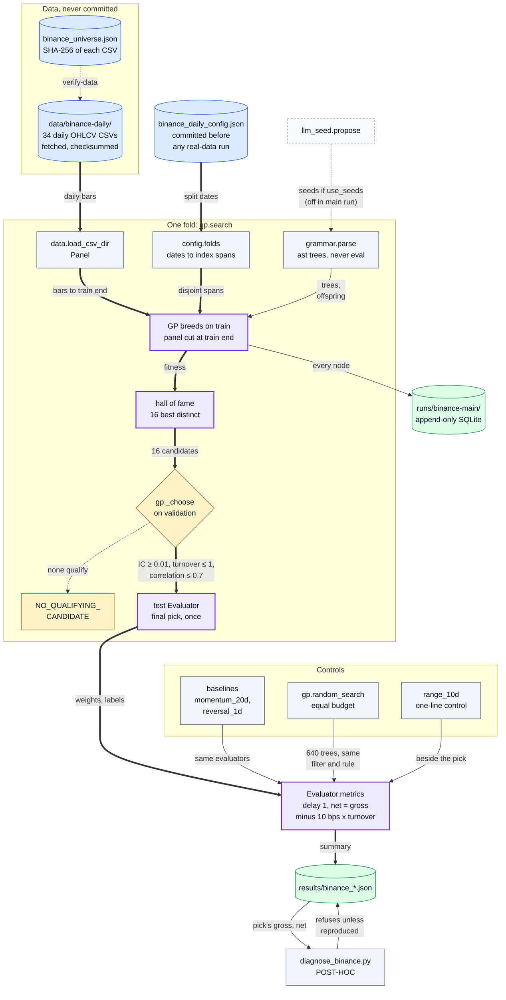
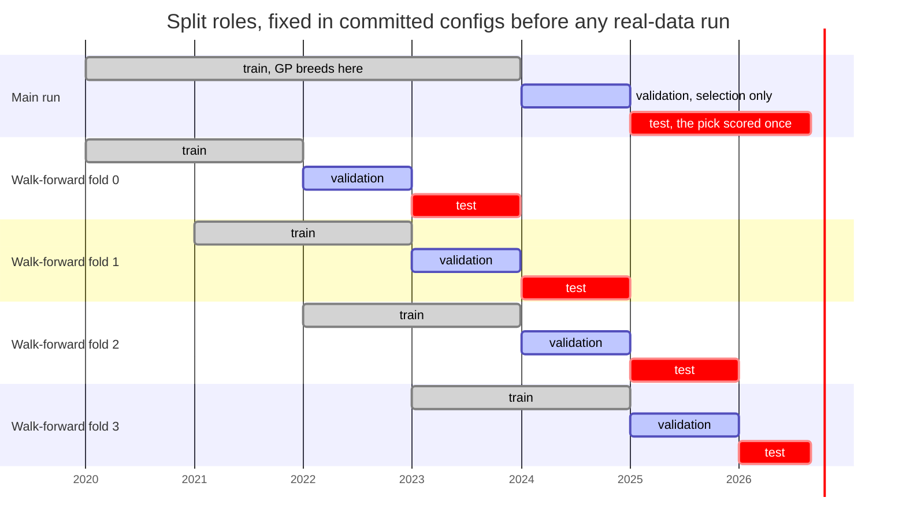

# alpha-gp-lab: genetic-programming alpha search with pre-registered splits

[](https://github.com/oscar-chw/alpha-gp-lab/actions/workflows/ci.yml) [](https://github.com/oscar-chw/alpha-gp-lab/actions/workflows/lint.yml)

A genetic-programming search over formulaic alpha factors that may only *breed* on train data,
*choose* on validation data and take one untouched test score, with delay-1 signals, costs, splits
fixed in committed configs before any real-data run, and an equal-budget random search as a
control. It is for anyone who wants to see what an alpha search finds when it cannot peek; Python
standard library only. On REAL Binance daily bars (34 surviving coins, test 2025-01 to 2026-08) its
pick reaches a test rank IC of about 0.08, matched by the random search, with returns not
significant before or after costs: a neutral result, not a tradable signal.

The alpha factory map: data and a pre-registered config go through one search, beside controls
scored with the same evaluator, delay and costs ([all diagrams](docs/DIAGRAMS.md); purple marks
the path the repo is about).



Where in the code: `scripts/fetch_binance_daily.py`, `src/alpha_gp_lab/{data,config,grammar,gp,evaluate,llm_seed,store,cli}.py`,
`fixtures/binance_daily_config.json`, `fixtures/binance_universe.json`, `scripts/analyze_binance.py`
(random search, `range_10d`), `scripts/diagnose_binance.py`.

## Why this exists

Searching a huge space of formulaic factors (`rank(-ts_delta(close, 5))` and the like, in the
style of Kakushadze, "101 Formulaic Alphas", 2016) is cheap; honest evaluation is not. A search
allowed to look at the data it is judged on will always find something, and an LLM asked for
"good alphas" adds a second, unaudited source of ideas. This lab asks what a
search finds when it may only breed on train, choose on validation and accept one test score, and
whether that survives a regime change.

## Approach

- **Grammar.** Expressions are parsed with Python's `ast` into frozen trees, never `eval`ed:
  6 fields, 19 named operators and `+ - * /`; anything else is refused with a reason.
- **Evaluation.** Delay 1, close-to-close; daily ranks become a dollar-neutral, unit-gross book;
  the evaluator reports rank IC, turnover, and gross and net return (net = gross minus fee x turnover).
- **Genetic programming.** Tournament selection, elitism, crossover and five mutations; every
  offspring is re-parsed, and duplicate and semantically equivalent signals are dropped. Fitness
  is rank IC minus turnover and size penalties.
- **Split roles.** Train fitness drives breeding; validation re-scores the 16-member hall of fame
  and picks with IC, turnover and correlation thresholds; test scores that one pick once. Each
  evaluator is built on the panel cut at its own split's end, so later bars do not exist in it.
- **Controls.** Fixed baselines, an equal-budget random search sharing the GP's filter and
  validation rule, and a one-line range factor, all scored the same way.
- **Replay.** Each run writes an append-only SQLite lineage and a hash manifest; `verify`
  recomputes the whole experiment and compares it byte for byte.

Split roles on the real data, from the committed configs (walk-forward folds 2 and 3 fall inside
the main test window):



Where in the code: `fixtures/binance_daily_config.json` and `fixtures/binance_walkforward_config.json`
(`splits`), `config._split` (refuses spans that are not ordered and disjoint), `config.folds`,
`gp.search` (`panel.head(te + 1)`, `panel.head(ve + 1)`, `panel.head(xe + 1)`).

Full method: [docs/method.md](docs/method.md); the GP loop and the LLM seed path are diagrams 3
and 4 in [docs/DIAGRAMS.md](docs/DIAGRAMS.md).

### Design decisions

Parse, never `eval`; standard library only; split roles enforced by construction; configs
committed before any real-data run; rank IC as fitness; delay 1; real data pinned by hash, never
committed. Each choice and what it costs: [docs/design-decisions.md](docs/design-decisions.md).

## Results

REAL = Binance daily spot, 34 USDT pairs still trading in 2026 (survivorship-biased), test window
2025-01 to 2026-08 (607 days), 10 bps per side. Rounded here; exact values in the linked files.

| Question | Result | Evidence |
|---|---|---|
| Does the GP pick rank coins on test? (REAL) | Yes: rank IC 0.082, t 7.1 (Newey-West 7.6) | [main run](docs/results.md#main-run), `results/binance_daily_main.json` |
| Does it make money? (REAL) | No: gross t 0.96, net 7.0e-5 per day, net t 0.19 | [main run](docs/results.md#main-run), [diagnostics](docs/results.md#what-the-test-ic-is-post-hoc-diagnostics) |
| Does GP beat equal-budget random search? (REAL, 20 seeds each) | No: test IC 0.072 vs 0.067, 0.87 SE (rule: 2 SE); test net 1.67 SE, which passed (3.06 SE) before the cost amendment below | [follow-up](docs/results.md#follow-up-analyses-pre-registered-after-the-main-result), `results/binance_analysis.json` |
| Does a one-line factor match the pick? (REAL) | Yes: 10-day mean range, test IC 0.082 vs 0.082 | [follow-up](docs/results.md#follow-up-analyses-pre-registered-after-the-main-result) |
| What is the IC? (REAL, POST-HOC) | Mostly a fixed tilt: a frozen 2024 ranking scores 87% of it, constant low beta 81%; 60% survives beta and size neutralisation, on down days only, like low volatility | [diagnostics](docs/results.md#what-the-test-ic-is-post-hoc-diagnostics), `results/binance_diagnostics.json` |
| Does it hold across years? (REAL, 4 walk-forward folds) | Mean test IC 0.049, all 4 folds positive, but net negative in 3, and 2 folds pick raw `-volume`, a size proxy | [walk-forward](docs/results.md#walk-forward), `results/binance_walkforward.json` |
| Can split discipline catch a regime change? (SYNTHETIC) | No: validation IC 0.13, then test IC -0.19 when the effect flips | [synthetic results](docs/synthetic-results.md) |
| Do LLM seeds help on real data? | Not tested: the one live attempt failed before reaching a model | [LLM seeds](docs/llm-seeds.md), `results/llm_live_attempt.json` |

**Amendment, 2026-10-06.** Review found that costs were charged against yesterday's target weights,
not the book after the day's returns moved it, so part of the real turnover was never paid for.
The evaluator now charges the drifted book; the pre-registered config is byte-identical and every
result was regenerated by the repo's scripts. The pick is unchanged; its test net fell from 8.05e-5
to 7.01e-5 per day (t 0.22 to 0.19) and the borrow break-even from 5.88% to 5.11% a year. **GP no
longer beats random search on test net** (3.06 to 1.67 SE), and every walk-forward fold changed its
pick. Old and new figures: [results.md](docs/results.md#amendment-2026-10-06-costs-charged-on-the-drifted-book).

## Quick start

```sh
export PYTHONPATH=src                                  # Python 3.11, nothing to install
python3.11 -m alpha_gp_lab demo --out runs/demo        # SYNTHETIC regime-change demo, ~10 s
python3.11 -m alpha_gp_lab verify runs/demo            # hashes + full recomputation, exit 0
bash scripts/check.sh                                  # tests, demo, replays: "check.sh: all passed"
```

Real data (download, `verify-data`, the main and walk-forward runs, follow-up scripts):
[docs/reproduce.md](docs/reproduce.md).

## Project structure

```
src/alpha_gp_lab/   grammar, evaluator, GP and random search, stats, data, LLM seeds, run store, CLI
scripts/            check.sh, demo.sh, Binance fetcher, follow-up analysis, POST-HOC diagnostics, plots
fixtures/           SYNTHETIC and Binance configs, pinned universe, LLM replay (HAND-WRITTEN FIXTURE)
results/            printed summaries of every real-data run
tests/              unittest suite and exact-Fraction hand cases
docs/               method, results, evidence, limits, diagrams
.github/workflows/  CI (check.sh on Python 3.11) and lint
```

Docs: see [docs/README.md](docs/README.md).

## Limits

- **Survivorship bias.** The 34 coins were chosen in 2026 as large pairs still trading, by
  judgement, not a recorded screen; delisted coins are absent.
- **A reused test window in one falling market.** The window has had at least 176 counted looks,
  the follow-up was planned after seeing the main result, and the equal-weight basket fell 66% over it.
- **Simple costs.** A linear 10 bps per side; no spread, slippage, borrow or funding. A borrow cost
  above 5.1% a year wipes out the pick's test net, and one coin's squeeze outweighed the whole gross.
- **Statistics.** Newey-West, block-bootstrap and Bonferroni corrections cover the main pick only;
  no Reality Check or SPA test, and none of them handles a single-window market tilt.
- **No units in the recorded grammar.** Raw price and volume levels act as size proxies in some
  picks; the fix (`gp.unit_check`) exists but stays off until a window after 2026-08.
- **No real LLM output, and planted SYNTHETIC effects.** The only replay entry is hand-written,
  and finding a planted effect shows the machinery works, not that there is an edge.

Every limit in full: [docs/limits.md](docs/limits.md).

## What I learned

Lessons confirmed by Oscar on 2026-10-03, from the real-data results (before the POST-HOC diagnostics;
figures updated to the 2026-10-06 amendment):

- A strong rank IC is not a tradable return: test IC 0.082 (t 7.1), yet net 7.0e-5 per day (t 0.19)
  after 10 bps per side.
- Selecting on IC-based fitness can choose a signal that lost money on validation (net -4.2e-4 per
  day for the main pick). If net return is the goal, it has to be in the selection rule.
- Without diversity pressure the GP converges on one family: 14 of the 16 hall-of-fame members were
  near-copies of the pick's daily-range ratio, so "16 candidates" overstates the ideas tested.
- A qualification rule needs a coverage check: before the cost amendment, walk-forward fold 1
  selected a signal defined on 10 of 364 validation days.
- The textbook controls did poorly under delay 1 and 10 bps per side (1-day reversal net t -4.1,
  20-day momentum test IC -0.006). Beating them is a low bar, not a result.

## Credits and licence

- The multi-agent research pattern (one role proposes hypotheses, another implements and
  evaluates them, held-out results decide) comes from
  [microsoft/RD-Agent](https://github.com/microsoft/RD-Agent) (MIT), via Oscar's fork
  [Oscar-Codespace/RD-Agent](https://github.com/Oscar-Codespace/RD-Agent). Here the LLM proposes,
  the GP develops, and the validation and test splits decide; no code is reused.
- This repo grows out of Oscar's earlier offline search workflow, a toy-scale single-generation
  version with the same no-`eval` parsing, split roles and SQLite replay ideas, rewritten here.
- Operator names follow Kakushadze, "101 Formulaic Alphas" (2016); semantics are defined here, and
  no code or data from the paper is used.

Implemented with AI coding agents under Oscar's design and review. Licence: MIT ([LICENSE](LICENSE)).
