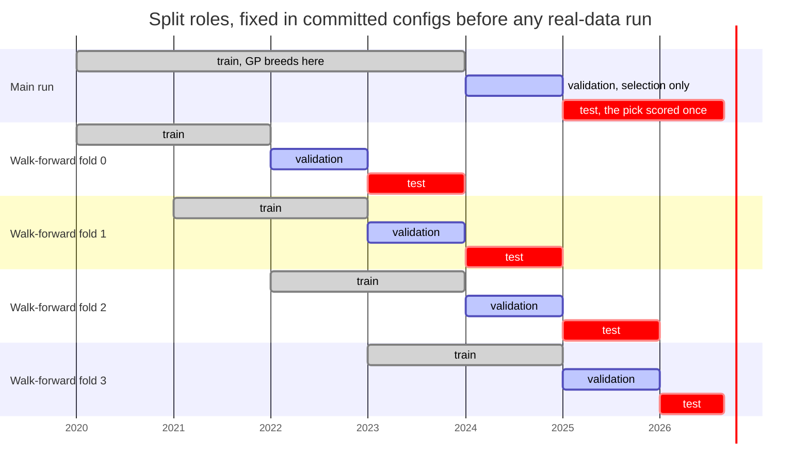
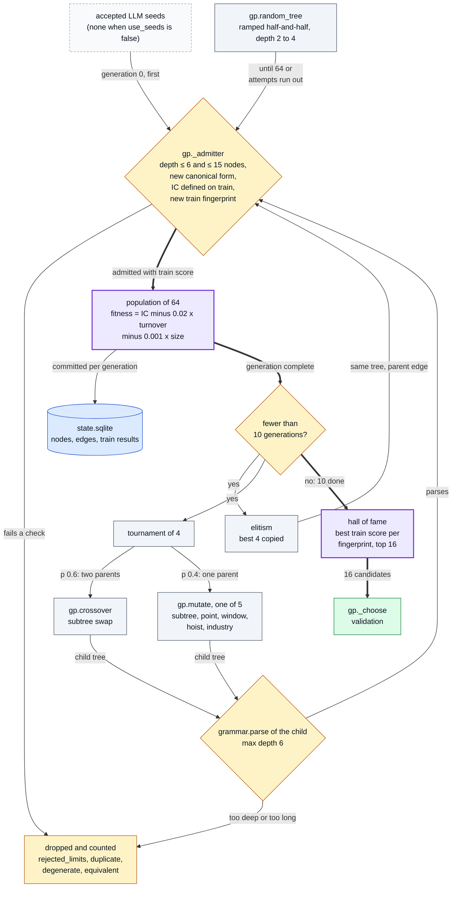
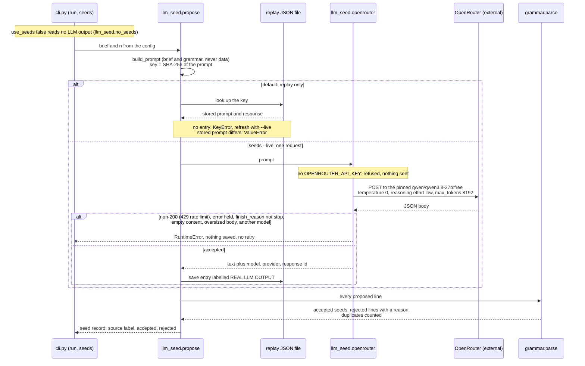
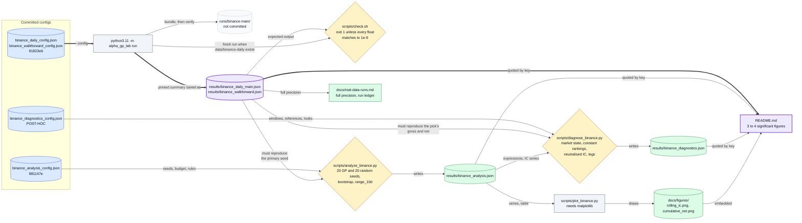

# alpha-gp-lab in diagrams

The visual companion to the [README](../README.md). Every box is a module, function, file or
command in this repository, and every label is taken from the code, the committed configs or
`results/*.json`. If a diagram and the code disagree, the code wins.

1. System overview: the alpha factory map
2. Split roles on the real data
3. The GP generation loop
4. The LLM seed path: replay or one live request
5. How a result reaches the README

The lineage schema (SQLite tables and their append-only triggers) is drawn in
[architecture.md](architecture.md#lineage-record).

Colours: blue = input or store, grey = processing, amber = a check that can refuse,
green = result, dashed = optional or external, purple = the path the repo is about.

## 1. System overview: the alpha factory map

Binance daily bars and a config committed before any real-data run go through one search that
may only breed on train, only choose on validation, and score one pick once on test; the
controls are scored with the same evaluator, timing and costs, and everything lands in
`results/*.json`.

```mermaid
flowchart LR
    subgraph DATA["Data, never committed"]
        FETCH["scripts/fetch_binance_daily.py"]
        CSV[("data/binance-daily/<br/>34 daily OHLCV CSVs")]
        UNI[("fixtures/binance_universe.json<br/>SHA-256 of each CSV")]
    end
    subgraph PREREG["Pre-registered in 91823e6"]
        CFG[("fixtures/binance_daily_config.json<br/>splits, GP budget, rule, costs")]
    end
    subgraph SEARCH["One fold: gp.search"]
        PANEL["data.load_csv_dir<br/>Panel"]
        FOLDS["config.folds<br/>ISO dates to index spans"]
        PARSE["grammar.parse<br/>ast trees, never eval"]
        TRAIN["GP breeds on train<br/>Evaluator on panel.head(train end + 1)"]
        HOF["hall of fame<br/>16 best distinct signals"]
        CHOOSE{"gp._choose on validation<br/>IC ≥ 0.01, turnover ≤ 1.0,<br/>correlation ≤ 0.7"}
        NONE["NO_QUALIFYING_CANDIDATE<br/>no test score"]
        TEST["test Evaluator<br/>final pick only, once"]
        COST["Evaluator.metrics<br/>delay 1, net = gross<br/>minus 10 bps x turnover"]
    end
    subgraph CTRL["Controls"]
        BASE["config baselines<br/>momentum_20d, reversal_1d"]
        RS["gp.random_search<br/>equal budget, no breeding"]
        ONE["range_10d<br/>one-line control"]
        DIAG["scripts/diagnose_binance.py<br/>frozen ranking, beta and size<br/>neutralised IC, POST-HOC"]
    end
    LLM["llm_seed.propose"]
    RES[("results/binance_*.json")]
    RUNS[("runs/binance-main/<br/>append-only SQLite,<br/>hash manifest")]

    FETCH -->|"SHA-256 vs .CHECKSUM"| CSV
    UNI -.->|"verify-data: hashes,<br/>rows, dates"| CSV
    CSV ==>|"daily bars, dates aligned"| PANEL
    CFG ==>|"train, validation,<br/>test date spans"| FOLDS
    PANEL ==>|"bars up to train end"| TRAIN
    FOLDS ==>|"ordered, disjoint spans"| TRAIN
    LLM -.->|"seeds only if use_seeds<br/>(false in the main run)"| PARSE
    PARSE -->|"random trees and<br/>every offspring"| TRAIN
    TRAIN ==>|"fitness: IC minus penalties"| HOF
    TRAIN -->|"every node, each generation"| RUNS
    HOF ==>|"16 candidates"| CHOOSE
    CHOOSE ==>|"top of the shortlist"| TEST
    CHOOSE -.->|"none qualify"| NONE
    TEST ==>|"daily weights and labels"| COST
    COST ==>|"printed summary"| RES
    BASE -->|"same three evaluators"| COST
    RS -->|"640 trees, same filter<br/>and validation rule"| COST
    ONE -->|"scored beside the pick"| COST
    RES -->|"the pick's committed<br/>gross and net"| DIAG
    DIAG -->|"refuses unless it<br/>reproduces them"| RES

    classDef data fill:#dbeafe,stroke:#1d4ed8,color:#0b1220
    classDef step fill:#f1f5f9,stroke:#475569,color:#0b1220
    classDef gate fill:#fef3c7,stroke:#b45309,color:#0b1220
    classDef out  fill:#dcfce7,stroke:#15803d,color:#0b1220
    classDef ext  fill:#f8fafc,stroke:#94a3b8,color:#0b1220,stroke-dasharray:4 3
    classDef key  fill:#ede9fe,stroke:#6d28d9,color:#0b1220,stroke-width:2px
    class CSV,UNI,CFG data
    class FETCH,PANEL,FOLDS,PARSE,BASE,RS,ONE,DIAG step
    class CHOOSE,NONE gate
    class RES,RUNS out
    class LLM ext
    class TRAIN,HOF,TEST,COST key
```

Where in the code: `scripts/fetch_binance_daily.py`, `src/alpha_gp_lab/{data,config,grammar,gp,evaluate,llm_seed,store,cli}.py`,
`fixtures/binance_daily_config.json`, `fixtures/binance_universe.json`, `scripts/analyze_binance.py`
(random search, `range_10d`), `scripts/diagnose_binance.py`.

## 2. Split roles on the real data

The main run and the four walk-forward folds, with the date spans from the committed configs:
the GP breeds on train, validation only chooses, and test scores the final pick once. Each
evaluator is built on the panel cut at its own split's end, so later bars do not exist inside
it. Walk-forward folds 2 and 3 fall inside the main test window; they are separate searches,
not extra evidence for the main pick.

Where in the code: `fixtures/binance_daily_config.json` and `fixtures/binance_walkforward_config.json`
(`splits`), `config._split` (refuses spans that are not ordered and disjoint), `config.folds`,
`gp.search` (`panel.head(te + 1)`, `panel.head(ve + 1)`, `panel.head(xe + 1)`).

## 3. The GP generation loop

One fold of `gp.search` with the main run's budget: every tree, whether an LLM seed, a random
tree or an offspring, passes the same admission filter before it is scored on train, and only
the hall of fame leaves the loop for validation. Duplicates and equivalents are checked within
each generation.

Where in the code: `src/alpha_gp_lab/gp.py` (`search`, `_admitter`, `random_tree`, `crossover`,
`mutate`), `src/alpha_gp_lab/evaluate.py` (`score`, `Evaluator.fingerprint`),
`src/alpha_gp_lab/grammar.py` (`parse`, `canonical`), `src/alpha_gp_lab/store.py` (`on_generation`);
budget from `fixtures/binance_daily_config.json` (`gp`, `fitness`).

## 4. The LLM seed path: replay or one live request

What happens when a config asks for seeds: by default the answer is read from a replay file
keyed by the prompt's SHA-256; `seeds --live` makes one request to the pinned open-weight model,
and any doubtful answer is refused and nothing is saved. Every line, replayed or live, must then
parse under the grammar. No live request has reached OpenRouter yet, and the main run uses no
seeds.

Where in the code: `src/alpha_gp_lab/llm_seed.py` (`propose`, `build_prompt`, `prompt_sha256`,
`openrouter`, `parse_response`, `no_seeds`), `src/alpha_gp_lab/cli.py` (`seed_record`, `load_inputs`),
`fixtures/llm_replay.json` (the only entry: a HAND-WRITTEN FIXTURE), `results/llm_live_attempt.json`.

## 5. How a result reaches the README

Every real-data number in the README is quoted from a committed `results/*.json` file, written by
a command over a committed config. The follow-up and diagnostic scripts refuse to run unless they
reproduce the committed main result first, and `check.sh` re-runs the main config against it
whenever the data is present.

Where in the code: `src/alpha_gp_lab/cli.py` (`summary`), `src/alpha_gp_lab/store.py` (`run`, `verify`),
`scripts/check.sh`, `scripts/analyze_binance.py`, `scripts/diagnose_binance.py`, `scripts/plot_binance.py`,
`fixtures/binance_{daily,walkforward,analysis,diagnostics}_config.json`.
