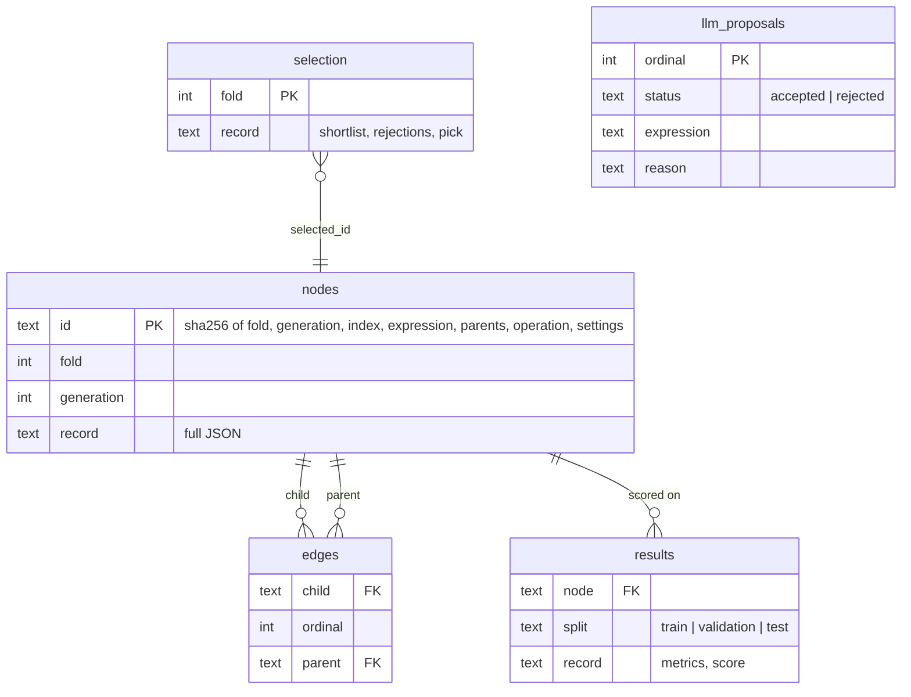

# Architecture

## Data flow and split roles

The data flow is drawn in [DIAGRAMS.md](DIAGRAMS.md#1-system-overview-the-alpha-factory-map) and the split roles in [DIAGRAMS.md](DIAGRAMS.md#2-split-roles-on-the-real-data).

Each `Evaluator` is constructed on `panel.head(end + 1)` for the span it scores, so a later
split's bars do not exist inside an earlier split's evaluator. The tests perturb every bar
after the validation span (and, separately, after the train span) and require the search and
selection to come out byte-identical.

## Modules

| Module | Responsibility |
|---|---|
| `grammar.py` | AST-based parser (no `eval`), frozen `Node` trees, canonical form for duplicate detection, the five industry-relative templates, the grammar text sent to the LLM, and `coin_units`, the per-coin unit check behind the opt-in `gp.unit_check` |
| `evaluate.py` | Local operator semantics, the delay-1 timing contract, rank IC, rebalancing turnover, net return, fitness, signal fingerprints and pairwise signal correlation |
| `gp.py` | Random trees, crossover, mutation, the generation loop, hall of fame, validation selection with the correlation filter, fixed baseline expressions scored on the same splits, walk-forward folds, and `random_search`: the equal-budget control that shares the admission filter and the validation rule |
| `stats.py` | Newey-West t-statistic, circular block bootstrap of a mean, normal p-value, Bonferroni bound, OLS residuals for neutralisation |
| `data.py` | `Panel`, the SYNTHETIC multi-regime generator, the CSV-directory loader, the pinned-universe check behind `verify-data` |
| `llm_seed.py` | Prompt, prompt-hash replay cache, grammar validation of every proposed line, optional live refresh through one request to the pinned open-weight model on OpenRouter (`qwen/qwen3.8-27b:free`) |
| `store.py` | Run bundle writer, append-only SQLite schema with triggers, completion manifest, `verify` replay |
| `config.py` | Strict config validation and fold construction (index or ISO-date spans; one fold, a listed set, or rolling) |
| `cli.py` | `demo`, `walkforward`, `run`, `verify`, `seeds`, `verify-data` |
| `scripts/analyze_binance.py` | The pre-registered follow-up analyses of the main real-data run (random search and GP over 20 seeds, inference, the simple control); refuses to run unless the main pick reproduces |
| `scripts/diagnose_binance.py` | POST-HOC diagnostics of the main pick: IC by market state, constant rankings, beta- and size-neutralised IC, leg composition, borrow break-even, the test-window family; refuses to run unless it reproduces the pick's gross and net |
| `scripts/plot_binance.py` | The README figures from `results/binance_analysis.json`; the only file that needs matplotlib |

## Lineage record

Every table has `BEFORE UPDATE` and `BEFORE DELETE` triggers that abort, plus a `BEFORE INSERT`
trigger that aborts when the key already exists (otherwise `INSERT OR REPLACE` would delete
and rewrite a row without firing the delete trigger). `verify` compares the stored schema
and trigger SQL with the expected DDL, so a renamed or emptied trigger is caught. Each generation
is committed before the next one starts, so an interrupted run leaves its finished
generations on disk and no `completion.json`; such a directory is refused for reuse.
